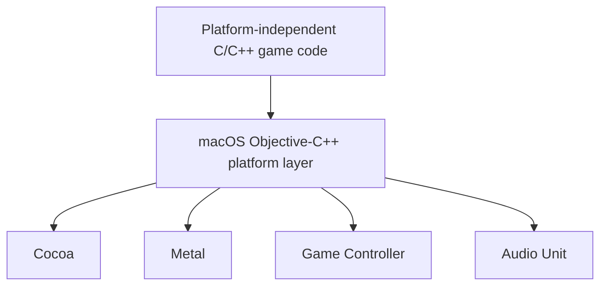
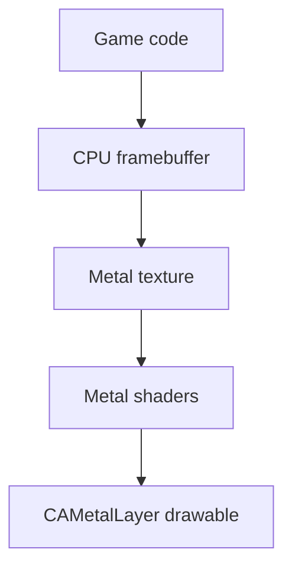

# Handmade Game Engine — macOS Platform Layer

> **Status:** In progress

A low-level macOS platform layer for platform-independent C/C++ game code, inspired by the architecture demonstrated in [Handmade Hero](https://handmadehero.org/).

The project explores how an operating-system layer can provide window management, input, graphics presentation, audio output, timing, and other platform services without requiring the game itself to depend directly on macOS APIs.

The platform-specific code is written in Objective-C++ and uses Cocoa, Metal, Core Audio’s Audio Unit APIs, and Apple’s Game Controller framework.

## Features

* Custom Cocoa application and frame loop without `NSApplicationMain`
* Native macOS window creation and application lifecycle handling
* Keyboard input through Cocoa event processing
* Game-controller input through Apple’s Game Controller framework
* CPU-rendered 32-bit framebuffer
* Metal-based framebuffer presentation
* Retina-aware rendering using backing-pixel dimensions
* Fixed rendering aspect ratio with GPU texture scaling
* Preallocated framebuffer storage to avoid repeated allocation during resizing
* Callback-driven audio output through Core Audio’s default output Audio Unit
* Real-time square-wave generation using 16-bit interleaved stereo PCM
* Command-line build pipeline for C++, Objective-C++, and Metal shaders

## Architecture

The platform layer separates operating-system-specific functionality from the game code:

The game writes pixels into a CPU framebuffer. Each frame, the macOS platform layer uploads the active portion of that framebuffer into a Metal texture. A small Metal rendering pipeline then displays the texture through a `CAMetalLayer`.

## Windowing and Application Loop

The application creates and manages its Cocoa window manually instead of using `NSApplicationMain`.

The main loop is responsible for:

1. Polling pending Cocoa events
2. Updating keyboard and controller state
3. Calling the platform-independent game code
4. Uploading the CPU framebuffer to Metal
5. Presenting the completed frame

This keeps control of frame execution inside the platform layer and follows the structure of a traditional handmade game loop.

## Rendering

The game renders into a 32-bit CPU pixel buffer rather than issuing GPU rendering commands directly.

The display pipeline works as follows:

1. The game produces a frame in CPU memory.
2. The active window-sized region is copied into a Metal texture.
3. A full-screen quad samples the texture using custom Metal shaders.
4. The result is presented through a `CAMetalLayer`.

A large CPU pixel buffer and Metal texture are allocated ahead of time. Window resizing changes the active rendering region instead of reallocating the framebuffer on every resize.

## Retina and Window Resizing

Cocoa measures view dimensions in logical points, while Metal textures and drawables use physical pixels.

The platform layer converts the content view’s dimensions from points to backing pixels and updates the `CAMetalLayer` drawable size accordingly. This allows the rendered image to remain sharp on Retina displays.

The window maintains a fixed rendering aspect ratio while still supporting different window sizes. Metal scales the framebuffer to the drawable when necessary.

## Input

### Keyboard

Keyboard events are processed through Cocoa’s event system. The platform layer maintains keyboard state across frames, allowing the game to distinguish between held keys and state changes.

### Game Controllers

Connected controllers are accessed through Apple’s Game Controller framework. The platform layer supports controller connection and disconnection handling and polls the selected controller’s current input state during each frame.

## Audio

Audio output is implemented using Core Audio’s default output Audio Unit. The platform layer configures a signed 16-bit, interleaved stereo PCM stream and registers an audio render callback.

The Audio Unit follows a callback-driven, pull-based model. When the output device needs more sample frames, Core Audio invokes the callback and provides an output buffer to fill. The current callback generates a continuous square wave directly into this buffer and writes each sample to both stereo channels.

A running sample index is preserved across callback invocations to maintain the waveform’s phase and prevent discontinuities between audio buffers. This establishes the audio-output path needed to supply game-generated sound through the platform layer.

## Building

The project uses a command-line build process based on Apple’s development tools:

* `clang++` compiles and links the C++ and Objective-C++ source code.
* `metal` compiles Metal Shading Language source into an intermediate `.air` file.
* `metallib` packages the compiled shaders into a Metal library.
* The executable links against Cocoa, Metal, GameController, and AudioUnit.

### Requirements

* macOS
* A Metal-capable Mac
* Xcode or the Xcode Command Line Tools
* Clang and the Metal compiler

## Current Status

This project is under active development. The current platform layer supports:

* Window and application management
* Event processing
* Keyboard and controller input
* CPU framebuffer management
* Metal-based display output
* Retina-aware window resizing
* Callback-driven Audio Unit output
* Real-time 16-bit stereo square-wave generation

Additional platform services and game-engine functionality will be added as development continues.

## Acknowledgments

The overall architecture is based on concepts demonstrated by Casey Muratori in [Handmade Hero](https://handmadehero.org/). This project is an independent macOS implementation created for learning and experimentation.
